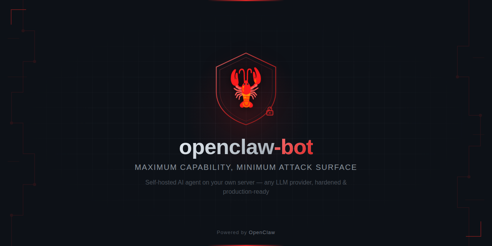

<p align="center">
  
</p>

<h3 align="center">The most thorough guide to deploying OpenClaw on your own server.</h3>

<p align="center">
  Security-first &bull; Any LLM provider &bull; Every decision explained
</p>

---

A practitioner's reference for deploying [OpenClaw](https://docs.openclaw.ai) on a self-hosted VPS — from a blank Ubuntu server to a hardened, production-ready AI agent with persistent memory, scheduled automation, and a security posture you can reason about.

> *Maximum capability, minimum attack surface.*

## Why This Exists

The official OpenClaw docs explain features well. What doesn't exist is a single resource that covers **end-to-end secure deployment** while explaining *why* each choice was made.

- **Reasoning, not just commands.** Every decision has a "Why?" block. Why these permissions? Why deny these tools? Why this auth method?
- **Security as first-class concern.** SSH hardening, 4-layer permission pipeline, skill supply chain vetting, egress firewall, threat model appendix.
- **Provider-agnostic.** Anthropic, OpenAI, OpenRouter, Ollama (free local models), and 20+ others. Choose your model, change your mind later.

## What You'll Build

A self-hosted AI agent on your own VPS — web search, shell access, persistent memory, scheduled automation, Telegram interface. You own the server, you own the data.

Production-ready means: systemd services, automated backups, health monitoring, log rotation, prompt caching, and a security model documented well enough to audit.

Every command is copy-pasteable. Every step has a checkpoint. Or point your AI agent at [AGENTS.md](AGENTS.md) and let it drive.

## Requirements

- A VPS (Ubuntu 22.04+, 2+ GB RAM)
- An API key from any supported provider — or run local models with [Ollama](https://ollama.ai) (free)
- A Telegram account

## The Guide

2,700 lines across 14 phases, three parts, and 8 appendices:

| Part | Phases | What It Covers |
|------|--------|---------------|
| **Get It Running** | 1-6 | VPS hardening, install, auth, Telegram, first chat, systemd |
| **Make It Solid** | 7-10 | OpenClaw security, identity, memory, backups & monitoring |
| **Make It Smart** | 11-14 | Skills, cron automation, cost optimization, context engineering |
| **Appendices** | A-H | Architecture, pipeline, multi-bot, threat model, config reference, runbook, references, supervisory control |

**[Read the guide &rarr; GUIDE.md](GUIDE.md)**

## Repository Map

```
GUIDE.md                          # The deployment guide (2,700 lines)
AGENTS.md                         # Machine-readable project context for AI agents

Reference/
  SECURITY.md                     # VPS/OS hardening + application/LLM security (2,600 lines, 55 sources)
  COST-AND-ROUTING.md             # Provider pricing, model routing, ClawRouter analysis
  IDENTITY-AND-BEHAVIOR.md        # System prompt design, persona patterns, identity-layer security
  SKILLS-AND-TOOLS.md             # Skill architecture, tool permissions, supply chain security
  MEMORY-PLUGIN-RESEARCH.md       # Why built-in memory over external plugins (mem0 eval)
  CONTEXT-ENGINEERING.md          # Prompt caching, session persistence, memory tuning
  SECURITY-PATCHES.md             # Version-specific security patches and action status
  UPGRADE-NOTES.md                # Comprehensive changelog across OpenClaw releases
  PAI-PIPELINE.md                 # Cross-agent pipeline: Gregor ↔ Isidore Cloud architecture

src/
  config/
    openclaw.json.example         # Sanitized config template with security annotations
    logrotate-openclaw            # Log rotation config
  scripts/
    backup.sh                     # Daily backup with 30-day retention
    health-check.sh               # Service health monitor
    verify-binding.sh             # Gateway binding verification
    auto-update.sh                # Weekly update + security audit
  pipeline/
    send.sh / read.sh / status.sh # Async messaging pipeline (local → bot)
  pai-pipeline/
    pai-submit.sh                 # Cross-agent task submission (Gregor → Isidore Cloud)
    pai-result.sh                 # Result reader with wait/ack modes
    pai-status.sh                 # Pipeline dashboard (human + JSON output)
  audit/
    audit.sh                      # Security audit prompts and tooling
```

## Reference Library

Deep research documents that informed real deployment decisions. Each started as a question during setup and grew into a standalone resource.

| Document | Lines | What It Covers |
|----------|-------|---------------|
| [Security](Reference/SECURITY.md) | 2,600 | VPS hardening, firewall rules, auditd, LLM-specific threats, exfiltration defense — 55 sources |
| [Cost & Routing](Reference/COST-AND-ROUTING.md) | 580 | Provider pricing comparison, fallback chains, caching math, ClawRouter compatibility |
| [Identity & Behavior](Reference/IDENTITY-AND-BEHAVIOR.md) | 590 | System prompt design, workspace-as-identity, persona security, Telegram constraints |
| [Skills & Tools](Reference/SKILLS-AND-TOOLS.md) | 570 | Bundled vs community skills, tool permissions, MCP security, supply chain vetting |
| [Memory Plugins](Reference/MEMORY-PLUGIN-RESEARCH.md) | 400 | mem0 evaluation, why built-in memory wins, embedding model benchmarks |
| [Context Engineering](Reference/CONTEXT-ENGINEERING.md) | 245 | Prompt caching strategies, cache-TTL pruning, token economics |
| [Security Patches](Reference/SECURITY-PATCHES.md) | 107 | Version-specific patches with action status tags |
| [Upgrade Notes](Reference/UPGRADE-NOTES.md) | 480 | Changelog across OpenClaw releases with deployment impact |
| [PAI Pipeline](Reference/PAI-PIPELINE.md) | 280 | Cross-agent pipeline: Gregor ↔ Isidore Cloud architecture, schemas, security model |

## Links

- **Official docs:** [docs.openclaw.ai](https://docs.openclaw.ai)
- **OpenClaw npm:** [npmjs.com/package/openclaw](https://www.npmjs.com/package/openclaw)
